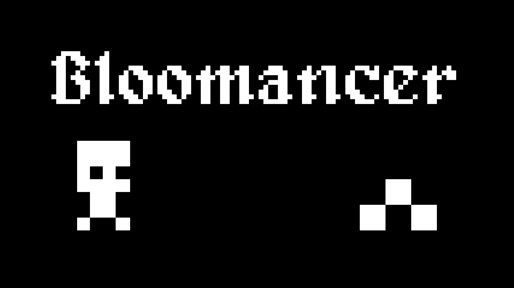
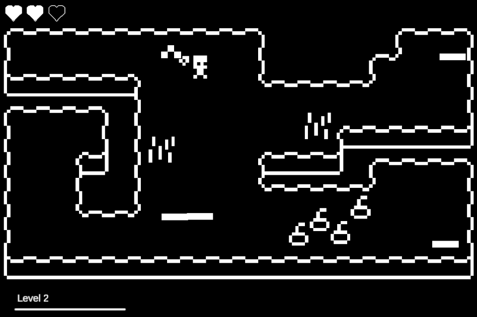

  

**Bloomancer** is an action roguelike where you play as a daring botanist-warrior fighting to reclaim his blooming garden from hordes of invading worms!

Move through ever-changing arenas, blasting your way through endless waves of enemies and gaining new powers as you grow stronger.  
Each run rearranges the maps, offering new layouts and tactical challenges every time.

##

- 🎮 **Gameplay**
  - **Objective:** Survive as long as you can while protecting your garden from waves of worms.
  - **Progression:** Gain new abilities and power-ups as your character levels up.
  - **Challenge:** Difficulty increases with each new wave.
  - **Variety:** Semi-procedural maps ensure every run feels fresh and unique.

  
  

- 🧠 **Features**
  - Semi-procedural maps with randomized order for each run  
  - Dynamic power-ups that evolve your abilities  
  - Endless waves of enemies for continuous challenge  

## 🎮 Controls

| Action | Key |
|:-------|:----|
| Move   | `WASD` |
| Shoot  | `Arrow Keys` |

## 🧑‍💻 Credits

Programming, game design, and assets by **me**.

##

- 🧩 **Tech Stack**
  - Engine: Unity  
  - Linguagem: C#  
  - Plataforma: WebGL  

##

[🎮 Play on Itch.io](https://brunoarnaud.itch.io/bloomancer)  
